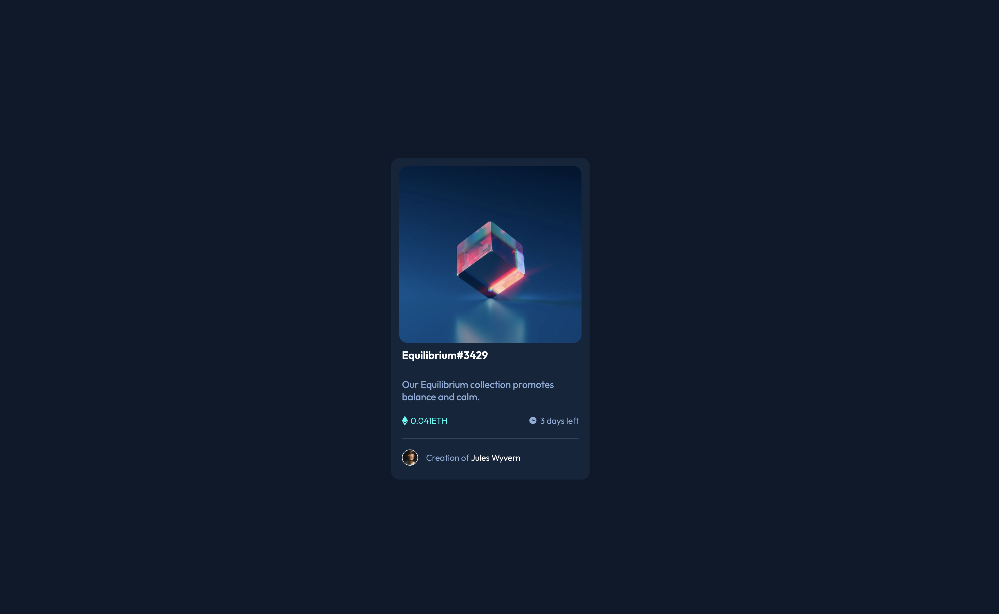

# Frontend Mentor - NFT preview card component solution

This is a solution to the [NFT preview card component challenge on Frontend Mentor](https://www.frontendmentor.io/challenges/nft-preview-card-component-SbdUL_w0U). Frontend Mentor challenges help you improve your coding skills by building realistic projects.

## Table of contents

- [Overview](#overview)
  - [Screenshot](#screenshot)
  - [Links](#links)
- [My process](#my-process)
  - [Built with](#built-with)
- [Author](#author)

## Overview

### Screenshot

### Links

- Live Site URL: [Live site URL](https://nft-preview-card-component-rose.vercel.app/)

## My process

### Built with

- Semantic HTML5 markup
- CSS
- Flexbox
- Grid

## Author

- LinkedIn - [Ismail Kemmoune](https://www.linkedin.com/in/ismail-kemmoune/)
- Frontend Mentor - [@IsmailKemmoune](https://www.frontendmentor.io/profile/IsmailKemmoune)
- Twitter - [@IsmailKemmoune](https://twitter.com/IsmailKemmoune)
